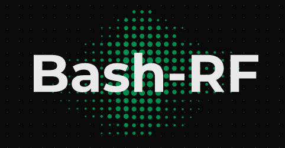

<p align="center">
  
</p>
<h1 align="center">Brute-force-garage-and-hack-rf🏡 📡</h1>
<p align="center">
  
  
  
  
 
</p>
<p align="center">
  
  
  
</p>
Script with several tools to brute force garages, hack radio stations and capture and analyze radio signals.

##

<h3><p align="center">Disclaimer</p></h3>

<i>All actions and/or activities related to this program are <b>your sole responsibility.</b> Misuse of this toolkit may result in <b>criminal prosecution</b> against the individuals in question. <b>Contributors will not be held responsible for any criminal charges brought against people who misuse this toolkit to break the law</b>.

This project just aims to demonstrate the flaws of the radio devices around us and <b>the understanding of radio signals</b>

  This <b>tool</b> is designed for educational purposes only. Do not try to break the law with anything contained here. If that's your intention, then get the hell out of here!

Have fun with it!!</i>

##

### Features
- `Capture radio signal 🔊`
- `Replay radio signal 🔁`
- `Brute force garage door 🔑`
- `Hack radio and Jam signal 📻 `
- `Save signals in an encrypted database ℹ️` 

### Installation
<h2>This script work only with Raspberry pi</h2>
| Raspberry Model      | Status  |
| ---------------------|:-------:|
| Pizero|OK|
| PizeroW|OK|
| PizeroW 2|OK|
| PiA+|OK|
| PiB|OK|
| PiB+|OK|
| P2B|OK|
| Pi3B|OK|
| Pi3B+|OK|
| Pi4|OK|

```
$ sudo git clone https://github.com/Lucstay11/Brute-force-garage-and-hack-rf/
```
Give rights to all directories
```
$ sudo chmod -R 750 Brute-force-garage-and-hack-rf
```
Install the depencies
```
$ cd Brute-force-garage-and-hack-rf
$ bash install.sh
```
Run the script
```
$ bash rf.sh
```

<h1 align="center">OPTIONS</h1>
More than 30 garage brands can be brute force with my program (provided you have a fixed code)
Citing well-known brands such as Hormann, Bosh, Chamberlain
<p style="color: red;">coucou</p>

