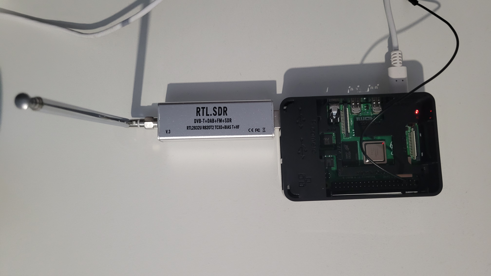
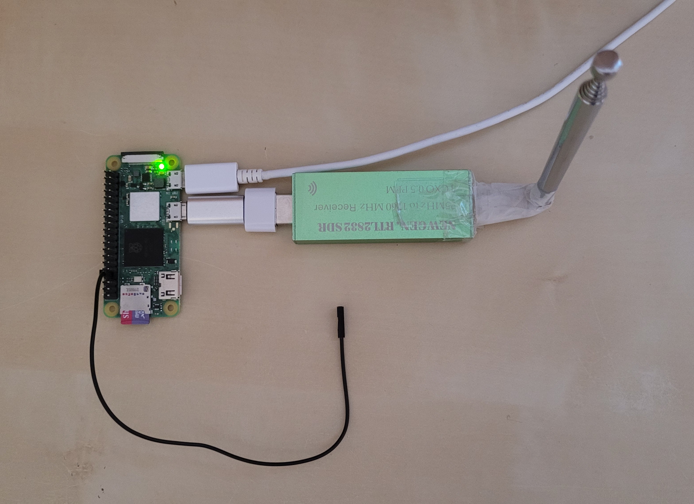
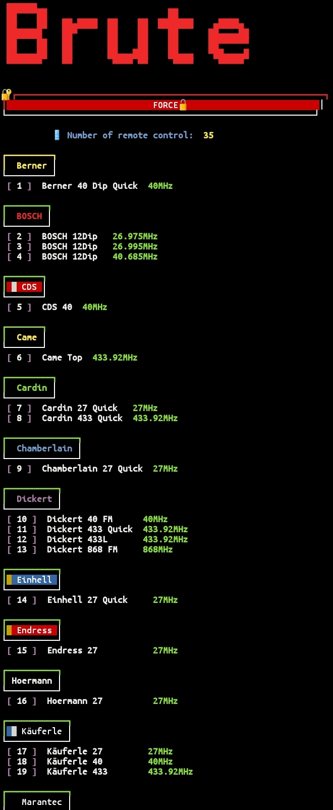

<p align="center">
<a href="https://github.com/Ignitetch/AdvPhishing/releases"></a>  
</p>
<p align="center">
  
</p>
<h1 align="center">Brute force garage and hack-rf with Raspberry Pi🏡 📡</h1>
<p align="center">
  
  
  
  
 
</p>
<p align="center">
  
  
  
</p>
Script with several tools to brute force garages, hack radio stations and capture and analyze radio signals.

##

<h3><p align="center">Disclaimer</p></h3>

<i>All actions and/or activities related to this program are <b>your sole responsibility.</b> Misuse of this toolkit may result in <b>criminal prosecution</b> against the individuals in question. <b>Contributors will not be held responsible for any criminal charges brought against people who misuse this toolkit to break the law</b>.

This project just aims to demonstrate the flaws of the radio devices around us and <b>the understanding of radio signals</b>

  This <b>tool</b> is designed for educational purposes only. Do not try to break the law with anything contained here. If that's your intention, then get the hell out of here!

Have fun with it!!</i>

##

### Features
- `Capture radio signal 🔊`
- `Replay radio signal 🔁`
- `Brute force garage door 🔑`
- `Hack radio and Jam signal 📻 `
- `Save signals in an encrypted database ℹ️` 

### Installation
<h2>This script work only with Raspberry pi</h2>
<h3>You need an RTL-SDR USB dongle for capture signal</h3>




| Raspberry Model      | Satus  |
| ---------------------|:-------:|
| Pizero|OK|
| PizeroW|OK|
| PizeroW 2|OK|
| PiA+|OK|
| PiB|OK|
| PiB+|OK|
| P2B|OK|
| Pi3B|OK|
| Pi3B+|OK|
| Pi4|OK|

```
$ sudo git clone https://github.com/Lucstay11/Brute-force-garage-and-hack-rf/
```
Install the depencies
```
$ cd Brute-force-garage-and-hack-rf
$ sudo chmod +x install.sh
$ bash install.sh
```
Run the script! You need to use sudo for everything to work properly
```
$ sudo bash rf.sh
```
If you have problem with right do this
Give rights to all directories
```
$ sudo chmod -R 777 Brute-force-garage-and-hack-rf
```
### For an optimal configuration use an ssh connection to connect with your phone and control the Raspberry Pi ###
<h1 align="center">OPTIONS</h1>
<p align="center">
  
  
</p>

<h2 align="center">Brute force Garage</h2>
<p align="center">
  
</p>

```
More than 30 garage brands can be brute force with my program (provided you have a fixed code)
Citing well-known brands such as Hormann, Bosh, Chamberlain ...Etc
```

For hard work and security reasons <b> remote keys are only available on request and at an affordable price of $25 (package includes 35 remotes of 10.5 GB in size)❗</b>
<h2>Send my an mail to receive captures from remote controls</h2>
<p align="center">

[](mailto:tues.banni@gmail.com)

</p>
<h2 align="center">Capture Signal 🔊</h2>

<p align="center">
  
</p>
<h3 align="center">Capture your signals with the RTL-SDR USB dongle and record them<h3>
  Several options are available to you
  
   - `Directly replay the captured signal (even in a loop!)` 
  - `Just save it in the database`
 
  
  **`INFO`** 
  You can also analyze already known band signals to determine their origins such as thermostats etc.

  <h2 align="center">Hack radio station 📻</h2>
  <p align="center">
  
  
  </p>
  <p>The audio files are in wav so be sure to convert your mp3/mp4 to wav</p>
  
  ```
  $ sudo apt-get install sox libsox-fmt-mp3
  $ sox example.mp3 -r 22050 -c 1 -b 16 -t wav converted-example.wav
  ```
  Add audios to folder **`.song`**
  
  <h2 align="center">Jam car key of garage key 🔑</h2>
  <b>Obviously here these are the most used frequencies</b>  
  
  
| Model      | Frequency  |
| ---------------------|:-------:|
| Car US|315 Mhz|
| Car EU|433.92 Mhz|
| Car AS|315 Mhz|
| somfy roller shutter|433.43 Mhz|
| Garage door|433.92 Mhz|
| Garage door|868.3 Mhz|

  
 <h2 align="center">Database ℹ️🔁</h2>

  
> <b>Replay your signal captured'</b>
> <b>A sha256 encrypted database that protects your captured signals from prying eyes!</b>
  


  
  ### Special Thanks :

- [**Derrow**](https://www.ifoedit.com/) <b>This project comes to me partly thanks to him go see his site I will never thank him enough for this know-how and his precious help!</b>
- [**F50EO**](https://github.com/F5OEO/rpitx)
- [**markondej**](https://github.com/markondej/fm_transmitter)

### Find Me on :
<p align="left">
  <a href="https://github.com/Lucstay11" target="_blank"></a>
  <a href="https://discord.gg/ZGfGVmaC" target="_blank"></a>

  [](mailto:tues.banni@gmail.com)

</p>

### For Donation :
<a href="https://www.paypal.com/donate?token=7c44QSUyRnxWD_YKtWMpVJd_WXvPAh470xPUP_qBjfCWPNAaPAGiW9AC1SDxZR3SxMs6BpVMVUVNjaVS" target="_blank"></a>
